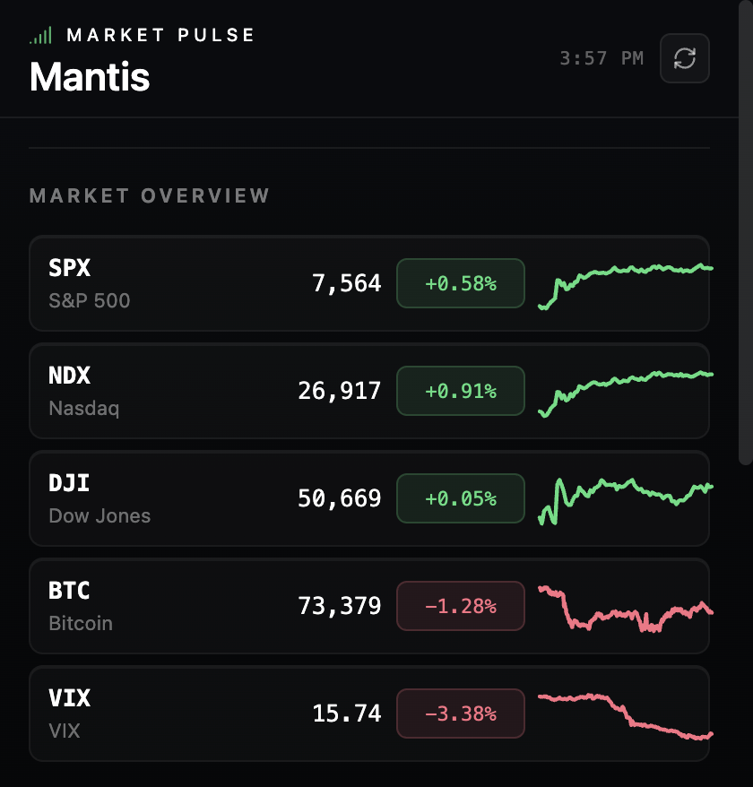
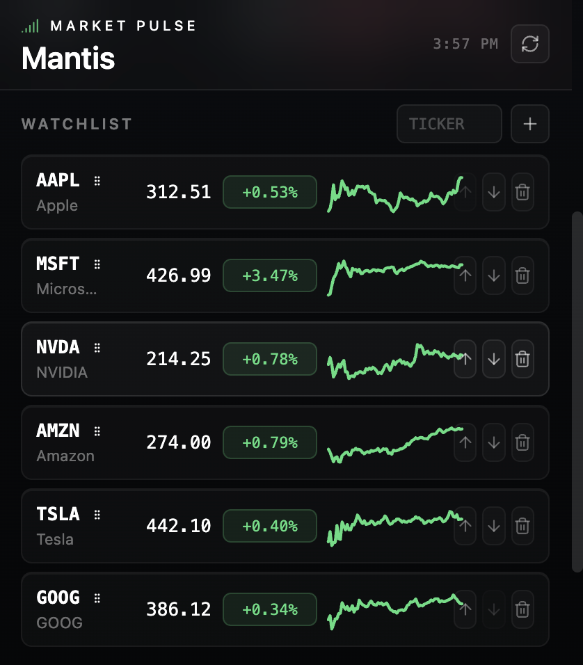
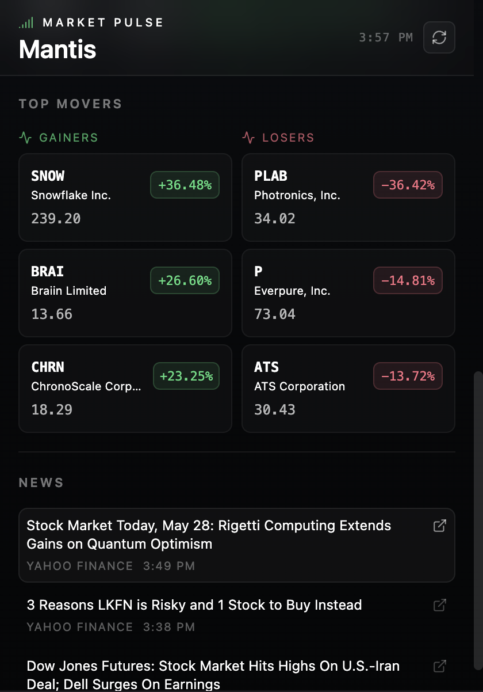

# Mantis

Mantis is a minimal Chrome extension for real-time market awareness.

Track:
- Major indices
- Watchlists
- Top movers
- Financial headlines

all from a compact popup interface designed for speed and clarity.

## Preview

### Market Overview


### Watchlist


### Top Movers + News


## Stack

- Plasmo Framework
- React
- TypeScript
- Tailwind CSS
- Chrome Extension Manifest V3

## Features

- Real-time market overview for major indices and crypto
- Persistent customizable watchlist using Chrome storage
- Live top gainers and losers
- Curated financial headlines
- Fast minimal popup UI optimized for quick scanning

## Market Data

Mantis uses free Yahoo Finance endpoints for quotes, intraday chart data, top movers, and RSS headlines. The extension requests only the required host permissions in `package.json`.

## Development

```bash
npm install
npm run dev
```

Plasmo will start a development build and print the extension output path.

## Production Build

```bash
npm run build
npm run package
```

The production extension is emitted to `build/chrome-mv3-prod`. The packaged ZIP is emitted by `plasmo package`.

## Load Unpacked In Chrome

1. Open `chrome://extensions`.
2. Enable Developer mode.
3. Click Load unpacked.
4. Select `mantis-extension/build/chrome-mv3-dev` during development or `mantis-extension/build/chrome-mv3-prod` after a production build.
5. Pin Mantis from the Chrome extensions menu.

## Commands

```bash
npm run dev      # Start Plasmo dev mode
npm run build    # Build production extension
npm run package  # Create distributable package
npm run lint     # Type-check TypeScript
```
